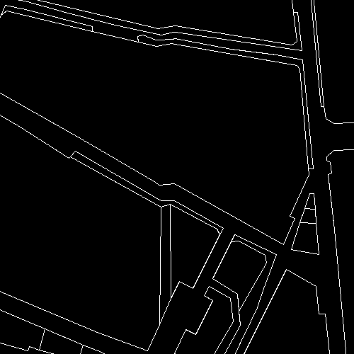
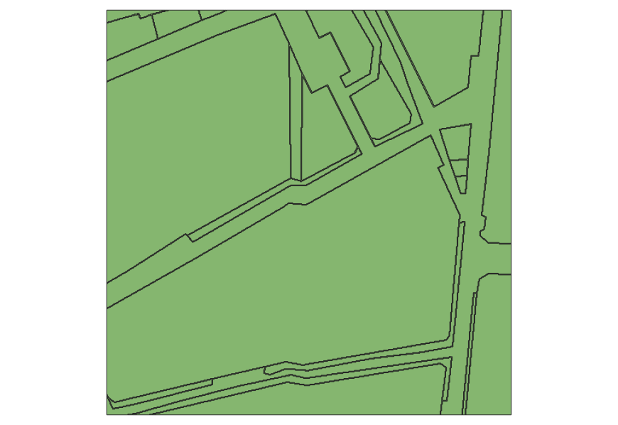
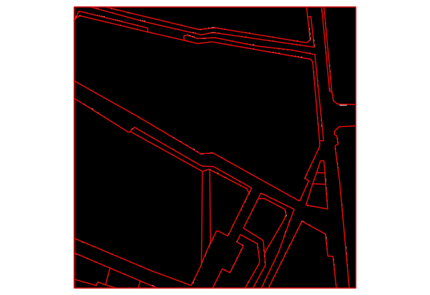
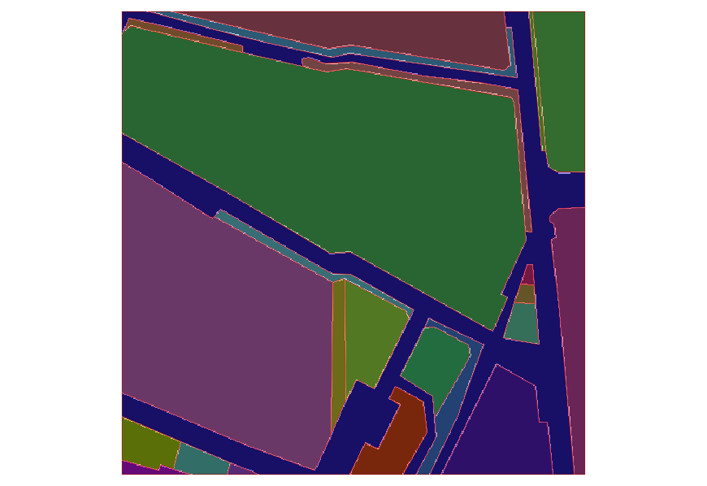

# centerlines

Creating a polygon layer and its edge layer from an input image can be done with:
```shell script
sbt -J-Xmx4G "runMain org.geohistoricaldata.PolygonizeImage -i data/BHdV_PL_ATL20Ardt_1898_0004.tif -l data/BHdV_PL_ATL20Ardt_1898_0004.lines.shp -p data/BHdV_PL_ATL20Ardt_1898_0004.polygons.shp --transform"
```

Other parameters are the following:
```commandline
Usage: PolygonizeImage [options]

-i, --in <file>                 in is the input image file
-l, --outLines <file>           out lines is the output file containing extracted centerlines
-p, --outPolygons <file>        out polygons is the output file containing extracted polygons
-z, --tilesize <value>          tilesize is used to tile the input image
-h, --threshold <value>         threshold is used to binarize the input image
-d, --densifyParameter <value>  densifyParameter is a double property used to densify the input geometries at the voronoi diagram step. It corresponds to the max distance between consecutive points on the geometry
-s, --simplifyTolerance <value> simplifyTolerance is a double property used to simplify the extracted centerlines. It corresponds to the distance tolerance of the Douglas-Peucker algorithm.
-t, --tolerance <value>         tolerance is a double property used at multiple stages to identify coordinates, build the voronoi diagram and snap geometries.
--transform                     transform is a flag : if set, transform the output geometries to match the input image (reverse y axis)
```

You can now convert the results back to raster:
```shell script
./convert_to_raster.sh data/BHdV_PL_ATL20Ardt_1898_0004.tif data/BHdV_PL_ATL20Ardt_1898_0004.polygons.shp data/BHdV_PL_ATL20Ardt_1898_0004.lines.shp data/result.tif
```

# Old documentation using gdal_polygonize
Create centerlines from input vectorized edges.

To use the centerlines builder, you need to install sbt: https://www.scala-sbt.org/download.html

## Step 1. Create the vectorized shapes
You can, for instance, use gdal_polygonize:
```shell script
gdal_polygonize.py data/178_4000_5000_4500_5500_gt.png data/input.shp
```





Please note that the image is inverted if you visualize it with a GIS (QGIS for instance).

## Step 2. Create the centerlines
```shell script
sbt "runMain org.geohistoricaldata.BuildCenterLines -i data/input.shp -l data/lines.shp -p data/polygons.shp --transform"
```




Note that the lines and polygons match with the input image thanks to the *transform* flag the transforms the resulting geometries.

